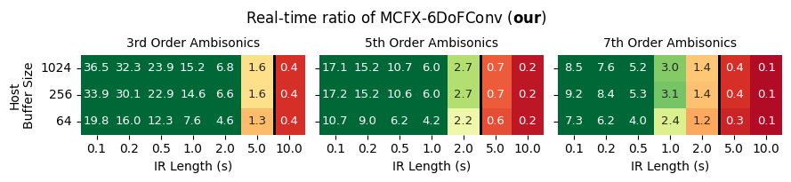
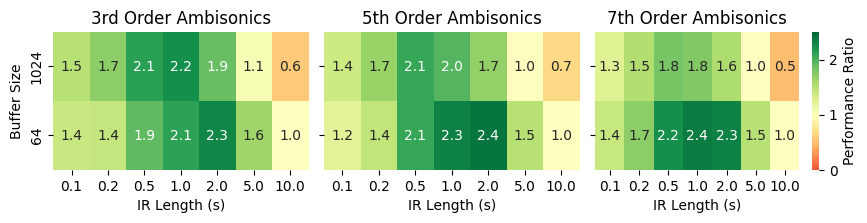
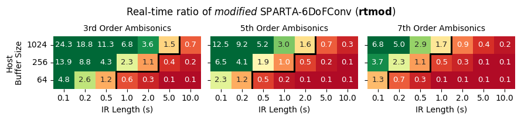
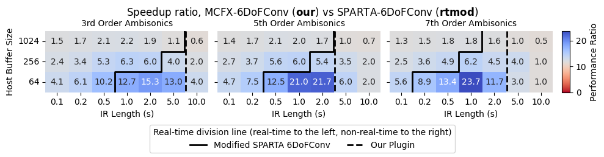

6DoF-SpatialAudioConvolver
---

This repository points to the source code for the __MCFX-6DoFConv__ plugin and contains the code for the performance comparison between the original SPARTA-6DoFConv plugin and the proposed MCFX-6DoFConv plugin.

## Plugin Source Code
The source code for the MCFX-6DoFConv plugin is contained in the submodule in `plugin-source/` (or [here](https://github.com/domenicostefani/SPARTA_Multi6DoF_project/)).  
Windows 64 plugin binaries [here](https://github.com/domenicostefani/SPARTA_Multi6DoF_project/releases/tag/MCFX-6DoFconv-1.0.0)

## Performance Comparison
Here we compare the performance of the following:
1. __SPARTA-6DoFConv__ (__original__ plugin, which is zero-latency only for buffer sizes >= 512)
2. __MCFX-6DoFConv__ (__our__ plugin with efficient convolution, always zero-latency)
3. __modified-SPARTA-6DoFConv__ (__rtmod__: plugin with lower buffer size cap to become zero-latency like ours, for fair comparison)

We measured computational efficiency by setting up REAPER projects with 63 configurations including different _host-buffer-sizes_, _IR lengths_, and _ambisonics order_ (num. channels).  
Measurements were performed on a 2020 Dell XPS 15 9500 laptop with the Windows 10 OS and an Intel(R) Core(TM) i7-10750H CPU, 6 cores, 12 logical processors, 32GB RAM.
Most background processes were disabled, including networking and bluetooth. 
Each plugin was hosted in a separate REAPER project with a single multichannel track, matching the ambisonics order of each IR configuration. 

For each configuration, we rendered a known-length input file in _fully offline_ mode with each plugin individually, and measure the time taken to render the file.  
Input audio file ranged from 5 minutes to 30 seconds depending on the configuration for the render time to be within a reasonable range, both for having a meaningful measurmement value and for the sake of time.  
It's worth noticing that the smallest input size of 30s is enough for both convolvers to reach a steady state where the tails of even the longest IRs are fully convolved along with early attach partitions.  

We report __Real-time ratio__ as the ratio between the render-time and the duration of the input file.
Real-time ratio therefore offers a proxy for the computational efficiency of the plugin, where a value of 1.0 indicates that the plugin can render the input file in real-time using the entire time allotted for the render.
Greater values indicate that the plugin is more computationally efficient, rendering the input file in less time than the duration of the input file, which would potentially allow for multiple instances of the plugin to run in real-time.
Smaller values indicate that the plugin cannot process in real-time for the given configuration on the test machine.

Finally, we report the __Speedup__ as the ratio between the real-time ratio of the original plugin and the real-time ratio of our plugin.
It is equivalent to the inverse of the ratio between the render times of the two plugins.
A speedup of 1.0 indicates that the two plugins have the same computational efficiency, regardless of whether the configuration is rendered in real-time or not.

### Real-time ratio of __original__ SPARTA-6DoFConv plugin
`analysis/outplots/rtratio_heatmap_gradient_old.png`

Note that, because the inner convolver of the original plugin has a minimum buffer size of 512 samples, it can process faster than real-time in average, however it introduces latency in the audio processing with respect to the host buffer size (for sizes of 512 and smaller).

### Real-time ratio of the proposed MCFX-6DoFConv plugin
`analysis/outplots/rtratio_heatmap_gradient_new.png`

Note: zero-latency for all buffer sizes.

### Speedup ratio of MCFX-6DoFConv plugin with respect to SPARTA-6DoFConv plugin
`analysis/outplots/speedup_heatmap.png`

### Modifying the original plugin for fair comparison
Despite the overall rt-ratio and speedup being in favor of the proposed plugin, they do not tell the whole story.
Since the old plugin caps the buffer size of the convolver to a minumum of 512 samples, it introduces latency in the audio processing.
While the plugin can process in real-time or faster __with respect to the inner (capped) buffer size_, it does not comply with the host buffer size (therefore the user's expected latency).
To have a fair comparison, we modified the original plugin to remove the lower buffer size cap of 512 samples.
As a consequence, zero-latency behavior is achieved, at the cost of increased number of partitions for the uniform partitioning scheme.
The results are as follows:

### Real-time ratio of __modified__ SPARTA-6DoFConv plugin
`analysis/outplots/rtratio_heatmap_gradient_MODDED_SPARTA6dof.png`

### Speedup ratio of MCFX-6DoFConv plugin with respect to __modified__ SPARTA-6DoFConv plugin
`analysis/outplots/MODDEDspeedup_heatmap.png`

### Repository
Plots are in `analysis/outplots/`  
Source data csv files are in `analysis/` along with averages of the repeated measurements.  

The code for producing the plots is in
`analysis/plot.ipynb`  

`data\` contains screenshot of render times but you won't need them.  
`analysis\0-clean_data.py` contains the code used to clean up raw data csv's, check for potential transcription errors, and average repeated measures.  
`data/PosChangeDelay_Bidule` contains Plogue Bidule project files for testing the CONTROL latency of the plugins (Namely the delay between the control message that changes listener position and the actual change of IR matrix reflected in the sound).

_Domenico Stefani, Jan 2025_
