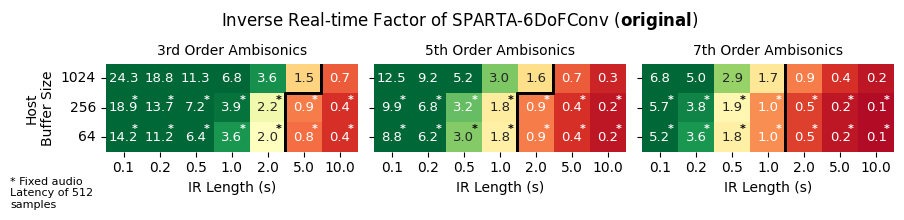
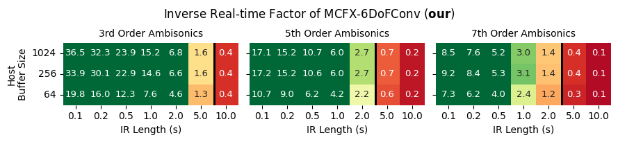
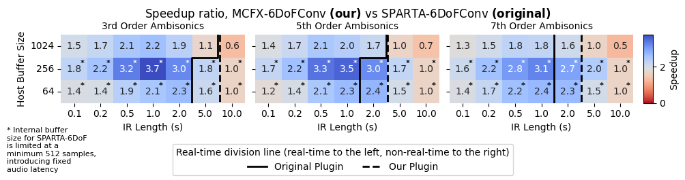
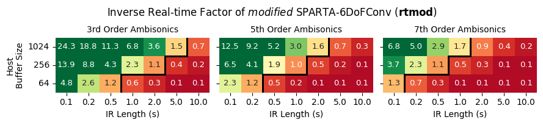
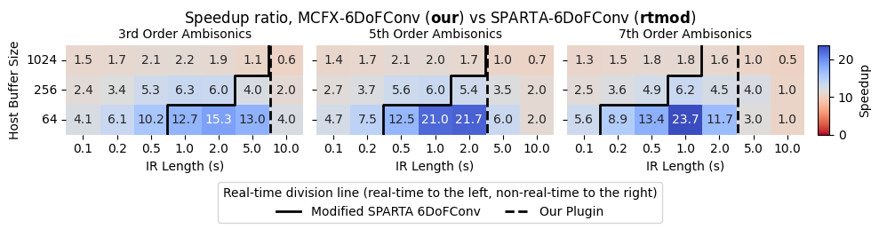

6DoF-SpatialAudioConvolver
---

This repository points to the source code for the __MCFX-6DoFConv__ plugin and contains the code for the performance comparison between the original SPARTA-6DoFConv plugin and the proposed MCFX-6DoFConv plugin.

## Plugin Source Code
The source code for the MCFX-6DoFConv plugin is contained in the submodule in `plugin/` (or [here](https://github.com/domenicostefani/SPARTA_Multi6DoF_project/tree/develop)).
Windows 64 plugin binaries [here](https://github.com/domenicostefani/SPARTA_Multi6DoF_project/releases/tag/MCFX-6DoFconv-1.0.0)

## Performance Comparison
Here we compare the performance of the following:
1. __SPARTA-6DoFConv__ (__original__ plugin, which is zero-latency only for buffer sizes >= 512)
2. __MCFX-6DoFConv__ (__our__ plugin with efficient convolution, always zero-latency)
3. __modified-SPARTA-6DoFConv__ (__rtmod__: plugin with lower buffer size cap to become zero-latency like ours, for fair comparison)

We measured computational efficiency by setting up REAPER projects with 63 configurations including different _host-buffer-sizes_, _IR lengths_, and _ambisonics order_ (num. channels).  
Measurements were performed on a 2020 Dell XPS 15 9500 laptop with the Windows 10 OS and an Intel(R) Core(TM) i7-10750H CPU, 6 cores, 12 logical processors, 32GB RAM.
Most background processes were disabled, including networking and bluetooth. 
Each plugin was hosted in a separate REAPER project with a single multichannel track, matching the ambisonics order of each IR configuration. 

For each configuration, we rendered a known-length input file in _fully offline_ mode with each plugin individually, and measure the time taken to render the file.  
Input audio file ranged from 5 minutes to 30 seconds depending on the configuration for the render time to be within a reasonable range, both for having a meaningful measurmement value and for the sake of time.  
It's worth noticing that the smallest input size of 30s is enough for both convolvers to reach a steady state where the tails of even the longest IRs are fully convolved along with early attach partitions.  

We report __Inverse Real-time Factor__ (iRTF) as the ratio between the duration of the input file and the render-time.
Inverse Real-time Factortherefore offers a proxy for the computational efficiency of the plugin, where a value of 1.0 indicates that the plugin can render the input file in real-time using the entire time allotted for the render.
Greater values indicate that the plugin is more computationally efficient, rendering the input file in less time than the duration of the input file, which would potentially allow for multiple instances of the plugin to run in real-time.
Smaller values indicate that the plugin cannot process in real-time for the given configuration on the test machine.

Finally, we report the __Speedup__ as the ratio between the iRTF of the proposed plugin over the iRTF of the original plugin.
It is equivalent to the inverse of the ratio between the render times of the two plugins.
A speedup of 1.0 indicates that the two plugins have the same computational efficiency, regardless of whether the configuration is rendered in real-time or not.

### Inverse Real-time Factor of __original__ SPARTA-6DoFConv plugin
`analysis/outplots/irtf_old.png`   

Note that, because the inner convolver of the original plugin has a minimum buffer size of 512 samples, it can process faster than real-time in average, however it introduces latency in the audio processing with respect to the host buffer size (for sizes of 512 and smaller).

### Inverse Real-time Factor of the proposed MCFX-6DoFConv plugin
`analysis/outplots/irtf_new.png`   

Note: zero-latency for all buffer sizes.

### Speedup ratio of MCFX-6DoFConv plugin with respect to SPARTA-6DoFConv plugin
`analysis/outplots/speedup_new_vs_old.png`   

### Modifying the original plugin for fair comparison
Despite the overall rt-ratio and speedup being in favor of the proposed plugin, they do not tell the whole story.
Since the old plugin caps the buffer size of the convolver to a minumum of 512 samples, it introduces latency in the audio processing.
While the plugin can process in real-time or faster __with respect to the inner (capped) buffer size_, it does not comply with the host buffer size (therefore the user's expected latency).
To have a fair comparison, we modified the original plugin to remove the lower buffer size cap of 512 samples.
As a consequence, zero-latency behavior is achieved, at the cost of increased number of partitions for the uniform partitioning scheme.
The results are as follows:

### Inverse Real-time Factor of __modified__ SPARTA-6DoFConv plugin
`analysis/outplots/irtf_rtmod_SPARTA6dof.png`   

### Speedup ratio of MCFX-6DoFConv plugin with respect to __modified__ SPARTA-6DoFConv plugin
`analysis/outplots/speedup_new_vs_modded.png`   

### Repository
The repository is organized as follows:
- `analysis/plot.ipynb` contains the code to generate the plots from the measured data, and the final plots (in `analysis/outplots/`).
- `bin/`  contains the Win64 binary of the modified-version of the original SPARTA plugin, where the lower cap on the internal buffer size is removed for the convolver.
- `data/` contains the measured data and code to measure audio latency and IR-change latency.  
- `measurement-projects/` contains the REAPER projects used for the measurements, and the code used to create the test SOFA files.
- `plugin-source` points to the submodule with the source code of the proposed MCFX-6DoFConv plugin.

_Domenico Stefani, Jan 2025_
